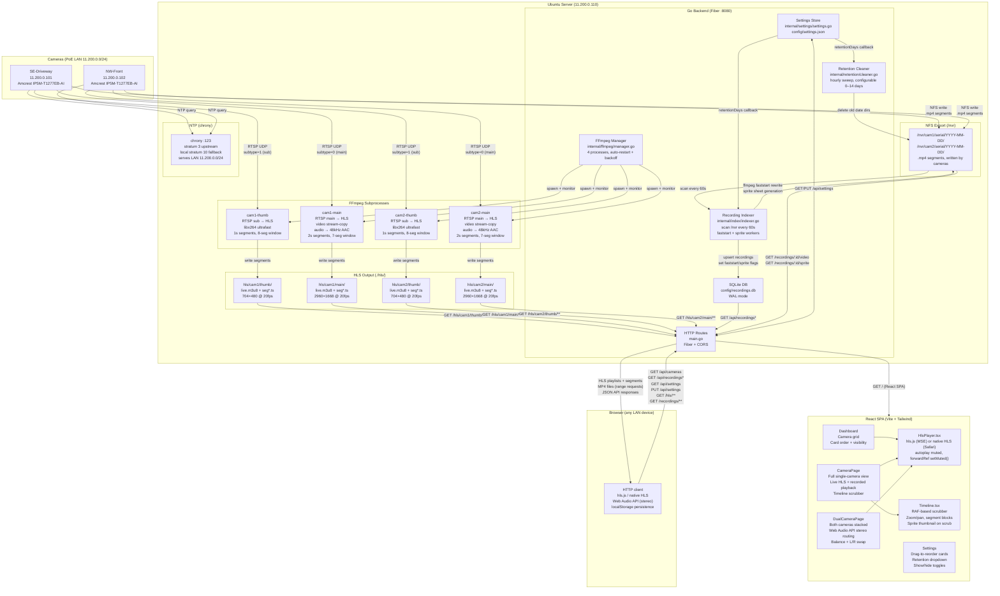

# Woodshop Security — Architecture

## System Overview

Two Amcrest PoE cameras feed a self-hosted Ubuntu server. The server runs a Go backend that manages FFmpeg live-streaming processes, indexes camera recordings, and serves a React SPA to any browser on the LAN. Cameras independently write recordings to the server over NFS — recording is entirely decoupled from the live streaming pipeline.

---

## System Diagram



---

## Pipeline: Live Streaming

```
Camera RTSP ──UDP──► FFmpeg subprocess ──► .ts segments on disk ──► Go static handler ──► hls.js in browser
```

| Process | Input | Video | Audio | Segments |
|---------|-------|-------|-------|----------|
| `{cam}-thumb` | subtype=1 (704×480) | libx264 ultrafast | AAC 22050Hz | 1s, 8-seg window |
| `{cam}-main` | subtype=0 (2960×1668) | stream copy (zero CPU) | AAC 48kHz 128kbps | 2s, 7-seg window |

**Why stream-copy for main:** No CPU or quality cost. The camera's H.264 CBR stream is delivered directly into MPEG-TS segments. Audio must be transcoded because the camera's RTSP stream carries AAC without valid ADTS framing headers.

**Why 2s segments for main:** Camera GOP (Frame Interval 40 = 2s at 20fps) — FFmpeg can only split at keyframe boundaries when stream-copying. `hls_time 2` matches the GOP exactly.

**HLS latency:** 2s segment + `liveSyncDurationCount: 2` in hls.js → ~6s behind live edge. `liveSyncDurationCount: 2` keeps two segments buffered, preventing the stall that occurred at the first segment boundary with count=1.

**Playlist caching:** `live.m3u8` served with `Cache-Control: no-cache, no-store` (bypasses Fiber's 10s static cache). `.ts` segments use `max-age=3600` (immutable once written).

---

## Pipeline: Recording (camera-side NAS)

```
Camera NFS client ──NFS──► /nvr/cam{N}/{serial}/YYYY-MM-DD/001/dav/{hour}/*.mp4
```

Cameras use their built-in NAS recording feature. Our backend plays no role in writing recordings — it only manages retention cleanup and indexing. Recording continues even if the backend is down.

**File format:** `.mp4` (H.264, directly browser-playable). In-progress files have a trailing `_` and are skipped by the indexer.

**Filename format:** `HH.MM.SS-HH.MM.SS[R/M][0@0][0].mp4` — encodes start time, end time, and motion flag (`R`=regular, `M`=motion). All times are local time, not UTC.

**Retention:** Goroutine sweeps `/nvr` hourly, deleting date-directories older than `retentionDays`. `retentionDays=0` disables cleanup.

---

## Pipeline: Recording Indexer

```
/nvr scan (60s) ──► SQLite upsert ──► faststart rewrite ──► sprite generation
```

| Step | File | Details |
|------|------|---------|
| Scan | `indexer.go` | Walk `/nvr` every 60s; 2 background workers; non-blocking enqueue |
| Faststart | `faststart.go` | Rewrite moov to file front; required — cameras write moov at end |
| Sprite | `sprite.go` | 240×135px frames at 1/10s, tiled 270×1; displayed at 320×180 in UI |
| DB | `db.go` | SQLite WAL; `faststart_failed` flag for corrupt files (no retry) |

---

## Pipeline: Playback

```
Browser seek ──► GET /api/recordings?cam=&date= ──► <video src="/recordings/:id/video"> ──► HTTP range requests
```

Playback uses native `<video>` with MP4 files served via HTTP range requests (206 Partial Content). No HLS involved. The Timeline scrubber shows all segments across all available dates; seeking loads the correct segment directly.

---

## Backend: Go / Fiber

| File | Responsibility |
|------|---------------|
| `main.go` | Entry point, Fiber app, routes, process wiring |
| `internal/ffmpeg/manager.go` | FFmpeg subprocess lifecycle — start, monitor, exponential-backoff restart |
| `internal/settings/settings.go` | Thread-safe JSON settings store; atomic write via temp-rename |
| `internal/retention/cleaner.go` | Hourly goroutine; walks `/nvr`, prunes dated dirs beyond retention window |
| `internal/index/indexer.go` | Scans NVR every 60s; queues faststart + sprite work |
| `internal/index/faststart.go` | ffmpeg moov-to-front rewrite; atomic rename via `.faststart.tmp` |
| `internal/index/sprite.go` | ffmpeg contact sheet: 240×135px, 1/10s, up to 270 frames |
| `internal/index/db.go` | SQLite CRUD for recordings |
| `internal/index/parse.go` | Parses Amcrest filename format to extract start/end time and motion flag |

**API surface:**

| Method | Path | Description |
|--------|------|-------------|
| GET | `/api/health` | Health check |
| GET | `/api/cameras` | Camera list |
| GET | `/api/settings` | Current settings (`retentionDays`) |
| PUT | `/api/settings` | Update settings |
| GET | `/api/recordings/dates?cam=` | Distinct dates with recordings, newest first |
| GET | `/api/recordings?cam=&date=` | All segments for camera+date, sorted by start_time |
| GET | `/recordings/:id/video` | MP4 file with HTTP range support (206) |
| GET | `/recordings/:id/sprite` | Sprite contact sheet JPEG |
| GET | `/hls/:cam/:stream/live.m3u8` | No-cache HLS playlist |
| GET | `/hls/**` | Cached `.ts` segments |
| GET | `/*` | React SPA (catch-all) |

---

## Frontend: React + Vite + Tailwind

| File | Responsibility |
|------|---------------|
| `App.tsx` | Router: `/`, `/camera/:id`, `/dual`, `/settings` |
| `pages/Dashboard.tsx` | Camera grid; reads `nvr_card_order` + `nvr_enabled` from localStorage |
| `pages/CameraPage.tsx` | Full single-camera view; live HLS + recorded playback; Timeline scrubber; sprite thumbnails |
| `pages/DualCameraPage.tsx` | Both cameras stacked; Web Audio API stereo via `StereoPannerNode` + `GainNode`; Safari native HLS fallback |
| `pages/Settings.tsx` | Drag-to-reorder (HTML5 DnD), show/hide toggles, retention dropdown |
| `components/CameraCard.tsx` | Thumbnail grid card (sub stream, 704/480 aspect ratio) |
| `components/DualCard.tsx` | Combined grid card; two stacked sub streams |
| `components/HlsPlayer.tsx` | hls.js player with `forwardRef` `setMuted()`; Safari auto-detects native HLS |
| `components/Timeline.tsx` | RAF-based scrubber; zoom/pan; sprite thumbnails; `headerContent` slot for controls |
| `components/Layout.tsx` | Top nav |
| `lib/api.ts` | Fetch wrappers + `hlsUrl()` |
| `lib/types.ts` | `Camera`, `RecordingSegment` types |
| `lib/dualSettings.ts` | `DualSettings` type, `CAM_NAMES`, `OTHER_CAM` |

**localStorage keys:**

| Key | Description |
|-----|-------------|
| `nvr_muted` | Mute state |
| `nvr_card_order` | Dashboard card order |
| `nvr_enabled` | Card show/hide state |
| `nvr_dual_settings` | Combined view L/R assignment + balance |

---

## Deployment

**Dev:**
```bash
cd backend && go run .          # starts FFmpeg + serves SPA on :8080
cd frontend && npm run dev      # Vite dev server on :5173, proxies /api and /hls to :8080
```

**Production (Docker Compose):**
```bash
docker-compose up --build
```
Single container: Go binary + pre-built React SPA. Bind mounts:
- `/nvr:/recordings` — NFS recording volume
- `./hls` — HLS segment output
- `./config` — settings + SQLite DB persistence
- `./frontend/dist:/app/static:ro` — React build

**NTP:** `chrony` on the server serves NTP to the LAN at `11.200.0.110:123`. `local stratum 10` ensures cameras stay synced when the internet is unavailable.
